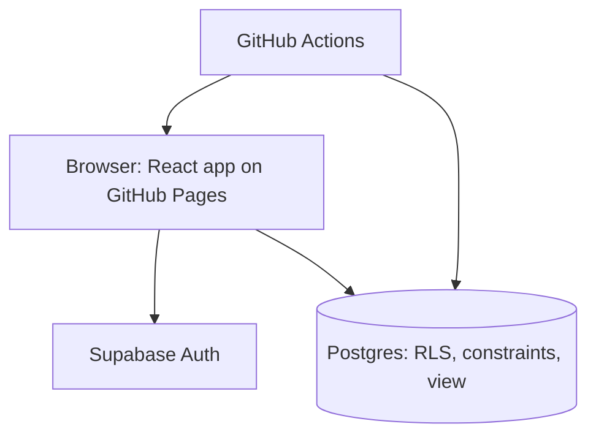

# Full Offload — Claude Code handoff

Sep 26, 2026 · @Jack

## Overview

Full Offload is a serverless web app that answers one question: "I have this hardware, what local LLMs can I run and how fast?" Users submit their machine, the command they run, and their measured speeds; visitors look up results for hardware like theirs.

- **Name:** Full Offload. Use this exact name everywhere (site header, README, Show HN title).
- **Domain:** fulloffload.com (registered at Hover). Tagline: "See which models hit full offload on your hardware."
- **Launch goal:** a Show HN post; the site must survive a front-page traffic spike (handled in the final performance pass).
- **Constraint:** no self-managed servers. Managed services and free tiers only.
- **Principle:** build the smallest thing that works (YAGNI). Anything not described here is out of scope until Jack asks for it.
- **Development model:** agents first. Claude Code does most of the work; Jack reviews and merges.
- **Status:** domain registered, public GitHub repo created, Supabase project created. No application code yet.

## Product scope

v1 has exactly two flows: look up results for a device, and submit a result. Scope is speed only; output quality is out of scope.

**Look up results (anonymous)**

1. Pick a device from a searchable list backed by the device lookup table. Users never enter specs.
2. See every runtime × model × quant × device count combination reported on that device, with multi-GPU rows labeled (for example, "2× RTX 4090") and single-card rows first, with median generation tok/s, median prompt-processing tok/s, typical context size, submission count, and the exact commands behind the numbers.

**Submit a result (signed in)**

1. Pick a device, or add a missing one by name (see Data model for matching).
2. Enter the device count, paste the command, and enter the measured speeds.
3. The parser pre-fills runtime, model, quant and context size; the user can edit any field before saving.

Any runtime is accepted (llama.cpp, Ollama, vLLM, MLX, LM Studio, others). Differentiators for the launch post: real measurements rather than estimates, any runtime, multi-GPU rigs, and the exact command behind every number.

## Architecture

A static React app on GitHub Pages talks directly to one Supabase project (Postgres and Auth, free tier). There is no application server and no Edge Functions: validation, rate limiting and device matching live in Postgres.

| Layer | Choice | Notes |
| --- | --- | --- |
| Hosting | GitHub Pages, custom domain fulloffload.com | Static files, deployed by GitHub Actions. |
| Frontend | React + Vite + TypeScript, Mantine UI | See "Frontend stack". |
| Database | Supabase Postgres, free tier, one project | No staging project. |
| Data API | On; auto-expose new tables off; automatic RLS on | Every table or view needs an explicit grant and an RLS policy. |
| Reads | supabase-js against a Postgres view | Aggregation in SQL. No caching yet. |
| Writes | supabase-js inserts guarded by RLS, check constraints and a rate-limit trigger | No server code. |
| Auth | Supabase Auth: Google, GitHub, email magic link | Sign-in required only to submit. |
| CI/CD | GitHub Actions | Checks, migrations, Pages deploy, keepalive. |



Reads go through one small data-access module in `web/`, so the final performance pass can swap in caching or static snapshots without touching components.

## Frontend stack

The frontend is a React single-page app built with Vite and TypeScript, using Mantine for all UI, designed mobile first with full utility on desktop.

| Concern | Choice | Notes |
| --- | --- | --- |
| Language | TypeScript, strict mode | No `any` without a comment explaining why. |
| Build | Vite | Static build to `web/dist`. |
| UI | React + Mantine (`@mantine/core`, `@mantine/hooks`, `@mantine/form`) | Add other official Mantine packages only when a screen needs them. |
| Styling | Mantine defaults + one theme file | PostCSS with `postcss-preset-mantine`, as Mantine's setup requires. |
| Data fetching | TanStack Query | Loading, error and cache state for Supabase calls. |
| Routing | React Router with `createHashRouter` | Routes like `/#/device/rtx-4090`. |
| Backend client | `@supabase/supabase-js` | Anon key only. |
| Testing | Vitest; one Playwright smoke test at phone width | Vitest covers the parser and device-name normalization. |
| Lint and format | ESLint (typescript-eslint) + Prettier | Enforced in CI. |

**Versions**

- Use the latest stable release of each dependency at scaffold time, pinned in the lockfile. No pre-release versions.
- Dependabot opens update PRs; CI must pass before Jack merges.

**Mantine rules**

- Stay as close to default Mantine as possible. The only customization is a single theme file (`web/src/theme.ts`, built with `createTheme`): primary color, font, radius, and similar tokens.
- No per-component style overrides, `styles` / `classNames` props, or global CSS that restyles Mantine components. Use component props (`variant`, `size`, `color`) and layout components (`Stack`, `Group`, `SimpleGrid`, `Grid`) instead.
- A CSS module is allowed only for layout that Mantine props can't express, and must be justified in the PR.
- Support light and dark color schemes through Mantine's built-in color scheme handling.

**Mobile first, strong on desktop**

- Design every screen at phone width first, then expand with Mantine's responsive props (for example, `cols={{ base: 1, md: 3 }}`) and `visibleFrom` / `hiddenFrom`.
- Layout is a header-only `AppShell`: logo, a "Submit a result" button, and sign-in or an account menu. No sidebar and no burger menu at any width, so the results table gets the full page width on desktop.
- Any result filters sit inline above the results, not in a sidebar.
- Results show as cards on mobile and as a sortable `Table` on desktop.
- The device picker uses Mantine's `Autocomplete`, with touch-friendly targets. Searching a family (for example, "m3 max") lists all its memory variants.

**GitHub Pages constraints**

- Hash routing means deep links and refreshes work on GitHub Pages with no server fallback. Keep hash URLs readable and stable, since they get shared.
- Set Vite's `base` to `/` for the custom domain.
- Everything is client-rendered: add static meta tags and an Open Graph image in `index.html` so link previews look good.

## Data model

The whole schema is three tables and one view. Device specs come from the lookup table, never from users.

| Table | Fields |
| --- | --- |
| `devices` | id, name, normalized\_name (unique), vendor, vram\_gb, memory\_bandwidth\_gbps, unified\_memory, status (curated \| user\_added) |
| `device_aliases` | normalized\_alias (unique), device\_id |
| `submissions` | id, user\_id, device\_id, device\_count, raw\_command, runtime, model, quant, context\_size, gen\_tok\_s, prompt\_tok\_s, created\_at |
| `results_by_device` (view) | device, device\_count, runtime, model, quant, median gen\_tok\_s, median prompt\_tok\_s, typical context\_size, count — grouped by device, device\_count, runtime, model and quant, so multi-GPU runs never blend into single-card medians |

- **Initial devices:** hand-curated from vendor spec pages, covering roughly the last three generations of NVIDIA, AMD and Apple Silicon. Each distinct memory and bandwidth configuration is its own device row, for example "Apple M3 Max (40-core GPU, 128 GB)" and "RTX 4060 Ti 16 GB". Memory size is part of the device, never a separate user-entered field.
- **Device names:** one normalization function in Postgres (lowercase, strip punctuation and vendor and series words like "nvidia" / "geforce", split letters from digits so "rtx4090" matches "RTX 4090", and canonicalize memory sizes such as "16 GB" to "16gb") fills `normalized_name` and `normalized_alias`. The unique index makes exact matches reuse the existing device automatically, and a new name that matches an alias is rejected the same way. Memory sizes are canonicalized rather than stripped, because memory is part of the device ("RTX 4060 Ti 8 GB" and "RTX 4060 Ti 16 GB" are different rows); curated devices without a memory size in their name get a "<name> <VRAM> GB" alias instead, so "RTX 4090 24GB" still resolves to "RTX 4090".
- **User-added devices:** name only, saved with `status = user_added` and shown as unverified until Jack adds specs. The picker suggests close existing matches first.
- **Merge script:** a SQL script with a dry-run mode that lists likely duplicates. Merging repoints submissions to the canonical device, saves the duplicate's name as an alias, and deletes the duplicate.
- **Grouping normalization:** the parser emits canonical lowercase runtime, model and quant strings (for example, `q4_k_m`), so equivalent submissions group into one result row. Parser fixtures cover these variants.
- **Constraints:** check constraints require positive speeds with sane upper bounds, `device_count >= 1`, and non-empty runtime and model.
- **Rate limiting:** a trigger rejects inserts past a fixed number of submissions per user per hour.
- **Speeds:** prompt-processing and generation speed stay separate fields; never combine them into one number.
- **Seed data:** Jack's own hardware and runs, through the submit form or a seed file.

## Auth, security and abuse controls

Row-level security on every table is the top security requirement, because the Supabase anon key ships in the frontend and is public.

- **Sign-in:** Google, GitHub, and email magic links via Supabase Auth. Browsing is anonymous; sign-in is required only to submit.
- **Email:** magic links are sent through Resend, configured as Supabase's custom SMTP (the built-in sender is only for testing).
- **OAuth setup:** a Google Cloud OAuth client and consent screen, and a GitHub OAuth app. Site and redirect URLs point to fulloffload.com, plus localhost for development. Google's consent screen needs a privacy policy URL, so the site includes a one-page privacy policy.
- **Explicit grants:** every migration that creates a table or view the frontend uses must `grant` minimum privileges to `anon` / `authenticated`. A missing grant shows as `permission denied for table`.
- **RLS policies:** public read on `devices`, `device_aliases`, `submissions` (the exact commands behind the numbers are public) and the results view, which is `security_invoker` so it reads through the `submissions` policies; users insert only as `auth.uid()` and can delete only their own submissions; signed-in users may insert `user_added` devices. A missing policy shows as an empty result, not an error.
- **Service role key:** not used by the app at all. Only Jack uses it, locally, for the merge script.
- **Abuse controls:** required sign-in, check constraints and the per-user rate-limit trigger.
- **Before launch:** audit every table and view for grants and RLS, and test with the anon key that raw writes and cross-user edits are rejected.

## Deferred

These are intentionally out of scope for now. Agents should not build them or design around them unless Jack asks.

- **Benchmark CLI** and verified runs.
- **Standard benchmark parameters;** store whatever the user reports.
- **Performance work:** caching and static snapshots, done in the final pass before launch.
- **Similar-hardware matching and "will it fit" estimates;** results show exact device matches only.
- **Inverse query and leaderboard views.**
- **Charts.**
- **Moderation tooling;** use the Supabase dashboard if needed.
- **Per-IP rate limits and CAPTCHA;** hCaptcha only if abuse appears.
- **LLM parsing fallback;** stored raw commands make it easy to add later.
- **Staging environment, extra domains, output-quality measurement.**

## Environments, repo and CI/CD

The repo is public with an MIT `LICENSE`. There is one Supabase project (prod, free tier); development runs on the local Supabase stack.

- **Local dev:** Supabase CLI runs the stack in Docker. Schema changes happen only through committed migrations; never edit the prod schema in the dashboard.
- **Frontend deploy:** GitHub Actions builds the Vite app and publishes to GitHub Pages (source set to "GitHub Actions"). Custom domain fulloffload.com with HTTPS enforced; Hover DNS points the apex (A/AAAA records) and `www` (CNAME) at GitHub Pages.
- **Database deploy:** on merge to `main`, an Action runs `supabase db push`.
- **Keepalive:** a scheduled Action runs a real query twice a week so the free-tier project doesn't pause after a week of inactivity. GitHub emails on workflow failures and before disabling scheduled workflows in inactive repos, so no custom alerting is needed.
- **Secrets:** `SUPABASE_ACCESS_TOKEN`, project ref and DB password in GitHub Actions secrets. The anon key and project URL are public and go in frontend config.

Repo layout (one monorepo):

```
CLAUDE.md            agent instructions (read first)
LICENSE              MIT
docs/architecture.md this handoff, kept current
web/                 React + Vite + Mantine app (includes the command parser)
supabase/migrations/ SQL migrations (grants, RLS, constraints with each table)
supabase/seed.sql    curated devices, Jack's seed runs
supabase/scripts/    device merge script
supabase/tests/      SQL/RLS tests
fixtures/commands/   real command strings with expected parse output
.github/workflows/   CI, deploy, keepalive
```

## Agent-first repo design

Claude Code will do most of the work in this repo, so everything an agent needs must be written down in the repo, be checkable by a command, and be safe to run locally.

**Context the agent can read**

- `CLAUDE.md` at the root: project summary, repo map, the commands below, conventions, and hard rules. Keep it short and current.
- `docs/architecture.md`: this handoff, the source of truth, updated in the same PR as any design change.

**One-command workflows**

- Package scripts for: start the local stack, reset and seed the DB, run all tests, lint and typecheck, build the site.
- Every command runs locally without prod credentials, so an agent can verify its own work.

**Verification over trust**

- CI on every PR: lint, typecheck, Vitest (parser fixtures and normalization), SQL/RLS tests against the local stack, the Playwright smoke test, and a production build.
- RLS tests prove that anon cannot write, users cannot edit others' rows, and ungranted tables are unreachable.
- Parser changes must add fixtures in `fixtures/commands/`; the fixtures are the spec.
- Generated TypeScript types from the DB schema are committed and checked in CI.

**Guardrails**

- Agents work on branches and open PRs, but never merge. Jack reviews and merges every PR; `main` is protected and deploys only after CI passes.
- No prod credentials in the agent's environment. Prod changes happen only through the deploy workflows.
- Hard rules in `CLAUDE.md`: never commit secrets; every new table ships with grants, RLS policies, constraints and tests in the same migration; never edit applied migrations; no Mantine style overrides outside `theme.ts`; don't build anything listed under Deferred.
- Small, scoped PRs: one build-order step or one GitHub issue each.

## Suggested build order

Schema first, performance last.

1. Scaffolding: `CLAUDE.md`, `docs/architecture.md`, `LICENSE`, package scripts, CI, Dependabot.
2. Supabase local stack linked to the prod project; confirm Data API settings.
3. Migrations: the three tables, normalization function, results view, constraints, rate-limit trigger, grants, RLS, and RLS tests.
4. Seed curated devices and the device merge script.
5. Command parser in `web/` with canonical output, driven by `fixtures/commands/`.
6. Frontend, mobile first: theme, AppShell, hash routes, device picker with "add missing device", results page, submit form with editable parsed fields, sign-in, privacy page.
7. Auth providers: Google, GitHub, and Resend SMTP.
8. GitHub Pages deploy, custom domain, Hover DNS, keepalive; Jack seeds his own runs.
9. Pre-launch: performance pass (caching or static snapshots), then a grants and RLS audit.
